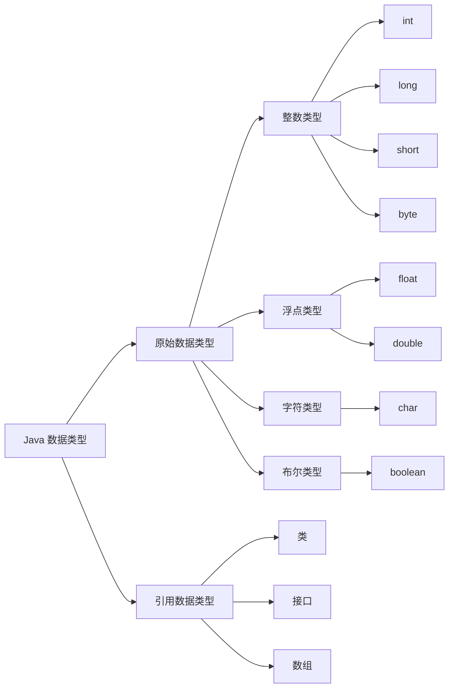

# markdown 语法

## 本身的语法 和 简单的扩展语法

### 标题、段落

| 元素   | 语法                                                            | 示例                                                          | 注意点或最佳实践                                                       |
|:-----|:--------------------------------------------------------------|:------------------------------------------------------------|:---------------------------------------------------------------|
| 标题   | 标题                                                            | # 号表示 1-6 级标题                                               | # 这是一级标题 <br>### 这是三级标题                                        | # 号和标题文字之间必须有一个空格，通常只使用一个一级标题作为文档的主标题，这符合良好的文档结构规范。                                                      |
| 段落   |                                                               |                                                             | 1.段落由一个或多个连续的文本行组成 <br>2.段落之间由一个或多个空行分隔 <br>3.普通段落不应该用空格或制表符缩进 |
| 强制换行 | 方法一：行尾两个空格加回车，<br>方法二：HTML 换行标签，<br>方法三：反斜杠（部分解析器支持）          |                                                             |                                                                |
| 分隔线  | 在一行中用三个以上的星号、减号、底线来建立一个分隔线，行内不能有其他东西                          |                                                             | 在星号或是减号中间可以插入空格                                                |
| 空行   |                                                               |                                                             | 在标题和内容之间留空行、<br>在列表前后留空行、<br>在代码块前后留空行、<br>保持一致的空行使用习惯         |
| 折叠   | `<details> 这里是被折叠的详细内容...你可以在这里放任何东西，包括代码、列表、甚至图片。</details>` | <details> 这里是被折叠的详细内容...你可以在这里放任何东西，包括代码、列表、甚至图片。</details> |

### 文本格式

| 元素       | 语法                                                                | 示例                                                         | 注意点或最佳实践              |
|:---------|:------------------------------------------------------------------|:-----------------------------------------------------------|:----------------------|
| 斜体       | `*文字*` <br> `_文字_` <br> `<i>文字</i>` <br> `<em>文字</em>`            | *文字* <br> _文字_ <br> <i>文字</i> <br> <em>文字</em>             | 段落的换行是使用两个以上空格加上回车    |
| 粗体       | `**文字**` <br> `__文字__` <br> `<b>文字</b>`<br> `<strong>文字</strong>` | **文字** <br> __文字__  <br> <b>文字</b><br> <strong>文字</strong> |                       |
| 粗斜体组合    | `***文字***`(推荐) <br> `___文字___`                                    | ***文字*** <br> ___文字___                                     | 推荐使用星号 * 在各种解析器中兼容性更好 |
| 删除线      | `~~文字~~`                                                          | ~~文字~~                                                     |                       |
| 下划线      | `<u>文字</u>`                                                       | <u>文字</u>                                                  |                       |
| 脚注       | [^要注明的文本]                                                         | vitepress不支持                                               | 脚注是对文本的补充说明           |
| 行内代码标记   | `` `文字` ``                                                        | ``文字``  ` <br> ` `文字` ``                                   | 包含反引号时，使用两个反引号包围      |
| 文本高亮     | `<mark>文字</mark>`                                                 | <mark>文字</mark>                                            |                       |
| 表示键盘按键   | `<kbd>Ctrl</kbd>+<kbd>S</kbd>`                                    | <kbd>Ctrl</kbd>+<kbd>S</kbd>                               |                       |
| 上标<br>下标 | `1<sup>1</sup>` <br> `1<sub>1</sub> `                             | 1<sup>1</sup>  <br> 1<sub>1</sub>                          |                       | |

### 列表

| 元素          | 语法                                                | 注意点或最佳实践                                      |
|:------------|:--------------------------------------------------|:----------------------------------------------| 
| 无序列表        | 使用星号(*)、加号(+)、减号(-)后面添加一个空格作为列表标记                 | 建议统一使用减号 -                                    |
| 有序列表        | 数字加上.和空格                                          | 数字可以不连续，Markdown 会自动修正数字顺序：                   |
| 列表嵌套        | 子列表需要缩进 2-4 个空格（推荐 2 个）                           | 可以无限层嵌套，但实际使用中建议不超过 3 层                       |
| 任务列表（复选框列表） | - [ ] 未完成的任务 <br>- [x] 已完成的任务 <br>- [ ] 另一个未完成的任务 | vitepress不支持 GitHub 风格 Markdown 的扩展功能，现在被广泛支持 |

### 区块

| 元素      | 语法                                  | 注意点或最佳实践                           |
|:--------|:------------------------------------|:-----------------------------------| 
| 单级引用    | > 段落文本                              | 只在第一行使用 > <br>其余行会自动包含在引用中：        |
| 多级嵌套引用  | > 段落文本 <br>>> 段落文本                  | 一个 > 符号是最外层<br>两个 > 符号是第一层嵌套，以此类推： |
| 区块中使用列表 | > 区块中使用列表 <br>> 1. 第一项 <br>> 2. 第二项 |                                    |
| 列表中使用区块 | 需要在 > 前添加四个空格的缩进                    |                                    |

### Emoji

| 元素    | 语法                                                                           | 示例                                                                                        | 注意点或最佳实践                                                                       |
|:------|:-----------------------------------------------------------------------------|:------------------------------------------------------------------------------------------|:-------------------------------------------------------------------------------|
| Emoji | `&#x2705;`成功<br>`&#x26a0;&#xfe0f;`警告<br>`&#x274c;`错误<br>`&#x2139;&#xfe0f;`提示 | &#x2705; **成功** <br>&#x26a0;&#xfe0f; **警告**<br>&#x274c; **错误**<br>&#x2139;&#xfe0f; **提示** | https://github.com/markdown-it/markdown-it-emoji/blob/master/lib/data/full.mjs |            

### 代码

| 元素      | 语法                                                                  | 注意点或最佳实践                                                                             |
|:--------|:--------------------------------------------------------------------|:-------------------------------------------------------------------------------------|
| 代码块标题   | 在标记代码块语言之后，使用 title="你的标题" 属性来指定标题                                  |                                                                                      |
| 缩进式代码块  | 使用 4 个空格或者一个制表符（Tab 键）                                              |                                                                                      |
| 三反引号代码块 | 用 ``` 包裹一段代码，并指定一种语言                                                | 1.最常用的，支持语法高亮和多行代码展示，<br>2.缩进式代码块前后需要空行分隔，<br>3.所有代码行必须保持一致的缩进，<br>4.在列表中使用时需要8个空格缩进 |
| 行号显示    | ```javascript {.line-numbers}```  &#x26a0;&#xfe0f;部分支持，vitepress不支持 |                                                                                      |
| 代码差异对比  | ```diff                                                             | 用于显示代码的添加、删除或修改，常用于展示版本控制中的变更。                                                       |
| 代码块带标题  |                                                                     | `c [HelloWorld.c]`                                                                   |          
| 行号      | `:line-numbers` 或 `:no-line-numbers`                                | 可以在站点配置为每个代码块启用行号<br>也可以在代码块中添加标记来覆盖在配置中的设置                                          |          
| 指定起始行号  | `js:line-numbers=5`                                                 | 行号从 `5` 开始                                                                           |          
| 单行高亮    | `// [!code highlight]`                                              | 设置单行高亮                                                                               |          
| 多行高亮    | `js{2,4-5}`                                                         | 高亮第`2、4、5`行。单行如 `{2}`，多行如 `{2-5}`，混合如 `{2,4-5}`                                      |          
| 代码聚焦    | `// [!code focus]`                                                  | 在代码行后添加注释以聚焦该行                                                                       |          
| 多行聚焦    | `// [!code focus:3]`                                                | 聚焦从该行开始的连续3行                                                                         |          
| 增删标记    | `// [!code --]` 或 `// [!code ++]`                                   | 模拟 Git diff，标记新增或删除的代码行                                                              |          
| 错误/警告   | `// [!code warning]` 或 `// [!code error]`                           | 在代码行后添加注释以标记错误或警告                                                                    |          
| 导入代码片段  | `<<< @/filepath`                                                    | @ 的值对应于源代码根目录，默认情况下是 VitePress 项目根目录，除非配置了 srcDir。或者也可以从相对路径导入                       |          
| 代码组     | `::: code-group  ```js [组名]```  :::`                                |                                                                                      |

### 链接

| 元素      | 语法                                                                                                                                                                      | 注意点或最佳实践                                                                |
|:--------|:------------------------------------------------------------------------------------------------------------------------------------------------------------------------|:------------------------------------------------------------------------|
| 链接      | `[链接名称](链接地址)` <br> `[链接文字](链接地址 "可选的标题")` <br> `<链接地址>`                                                                                                                |                                                                         |
| 参考链接    | `[链接文字][参考标签]` <br>`[参考标签]: URL "可选标题"`                                                                                                                                 | 当参考标签与链接文字相同时，可以省略第二个方括号；<br>便于链接的统一管理和更新,<br>相同链接可以重复使用，避免重复定义         |
| 自动链接识别  | markdown直接输入网址：https://www.example.com <br>用尖括号包围：<https://www.example.com>                                                                                             | 现代 Markdown 解析器通常支持自动识别 URL 和邮箱地址                                       |
| 锚点链接的使用 | `## 目录 `<br>`- [第一章：介绍](#第一章介绍)` <br>`- [第二章：安装](#第二章安装)` <br>`- [第三章：使用方法](#第三章使用方法) `                                                                                 | 锚点链接用于在同一文档内跳转，特别适合长文档的导航                                               |
| 标题锚点    | 标题会自动应用锚点。可以使用 markdown.anchor 选项配置锚点的渲染                                                                                                                                |                                                                         |
| 自定义锚点   | # 使用自定义锚点 {#my-anchor}                                                                                                                                                  | 指定自定义锚点而不是使用自动生成的锚点                                                     |
| 内部链接    | `[Home](/)` 导航至根目录 <br> `[xx](/xx/)` 导航至xx目录下index.html <br> `[xx heading](./#heading)` 锚定到目录 xx 下的index文件中的一个heading标题上 <br> `[xx - three](../xx/three)` 导航至xx目录下three | 内部链接将转换为单页导航的路由链接。此外，子目录中包含的每个 index.md 都会自动转换为 index.html，并带有相应的 URL / |
| 外部链接    | 外部链接带有 target="_blank" rel="noreferrer"：                                                                                                                                |                                                                         |          |

### 图片

| 元素     | 语法                                                                              | 注意点或最佳实践                             |
|:-------|:--------------------------------------------------------------------------------|:-------------------------------------|
| 图片     | `` <br>  `` <br>`` | 推荐使用相对路径，便于项目移植，`` 标签可以指定宽高度和样式 |
| 图片链接组合 | `[](链接URL)`                                                    |                                      |
| 图片懒加载  | 通过在配置文件中将 lazyLoading 设置为 true，可以为通过 markdown 添加的每张图片启用懒加载。默认禁用                 |                                      |

### 表格

| 元素     | 语法                                                                     | 注意点或最佳实践 |
|:-------|:-----------------------------------------------------------------------|:---------|
| 表格     | 使用 `\|` 来分隔不同的单元格 <br>使用 `-` 来分隔表头和其他行                                 |          |
| 表格对齐方式 | `---:` 设置内容和标题栏居右对齐。<br>`:---` 设置内容和标题栏居左对齐。<br> `:---:` 设置内容和标题栏居中对齐。 |          |
| 单元格换行  | `<br>`标签                                                               |          |

## 目录

| 元素        | 说明                                                        | 语法 | 注意点或最佳实践 |
|:----------|:----------------------------------------------------------|:---|:---------|
| 目录表 (TOC) | `[[toc]]`               可以使用 markdown.toc 选项配置 TOC 的呈现效果。 |    |          |

## 自定义容器

| 元素           | 说明                                                                                                                      | 语法 | 注意点或最佳实践 |
|:-------------|:------------------------------------------------------------------------------------------------------------------------|:---|:---------|
| 自定义标题        | `::: info  xxx  `<br>`::: tip xxx `<br>`::: warning xxx `<br>`::: danger xxx `<br>`::: details xxx `<br>`... `<br>`:::` |    |          |
| GitHub 风格的警报 | `> [!NOTE]`<br>`> [!TIP]`<br>`> [!IMPORTANT]`<br>`> [!WARNING]`<br>`> [!CAUTION]`<br> `>`                               |    |          |
| raw          | 用来防止与 VitePress 的样式和路由冲突                                                                                                |    |          |

## 包含 markdown 文件

| 元素       | 说明                                            | 语法 | 注意点或最佳实践 |
|:---------|:----------------------------------------------|:---|:---------|
| 引入其他文件内容 | `<!--@include: ./parts/basics.md{开始行,结束行}-->` |    | 行数可以为空   | 

## 徽标

徽标可让你为标题添加状态。例如，指定部分的类型或支持的版本可能很有用。

### info <Badge type="info" text="info" />

### tip <Badge type="tip" text="tip" />

### warning <Badge type="warning" text="warning" />

### danger <Badge type="danger" text="danger" />

### custom element <Badge type="info">custom element</Badge>

## 其他高级配置

VitePress 使用 markdown-it 作为 Markdown 渲染器。上面提到的很多扩展功能都是通过自定义插件实现的。可以使用 .vitepress/config.js 中的 markdown 选项来进一步自定义 markdown-it 实例。

```javascript
import {defineConfig} from 'vitepress'
import markdownItAnchor from 'markdown-it-anchor'
import markdownItFoo from 'markdown-it-foo'

export default defineConfig({
    markdown: {
        // markdown-it-anchor 的选项
        // https://github.com/valeriangalliat/markdown-it-anchor#usage
        anchor: {
            permalink: markdownItAnchor.permalink.headerLink()
        },
        // @mdit-vue/plugin-toc 的选项
        // https://github.com/mdit-vue/mdit-vue/tree/main/packages/plugin-toc#options
        toc: {level: [1, 2]},
        config: (md) => {
            // 使用更多的 Markdown-it 插件！
            md.use(markdownItFoo)
        }
    }
})
```

## mermaid

```markdown
    ```mermaid
    graph LR
    A[Java 数据类型] --> B[原始数据类型]
    A[Java 数据类型] --> C[引用数据类型]
    
        B --> D[整数类型]
        B --> E[浮点类型]
        B --> F[字符类型]
        B --> G[布尔类型]
        
        D --> H[int]
        D --> I[long]
        D --> J[short]
        D --> K[byte]
        
        E --> L[float]
        E --> M[double]
        
        F --> N[char]
        
        G --> O[boolean]
        
        C --> P[类]
        C --> Q[接口]
        C --> R[数组] 
```

